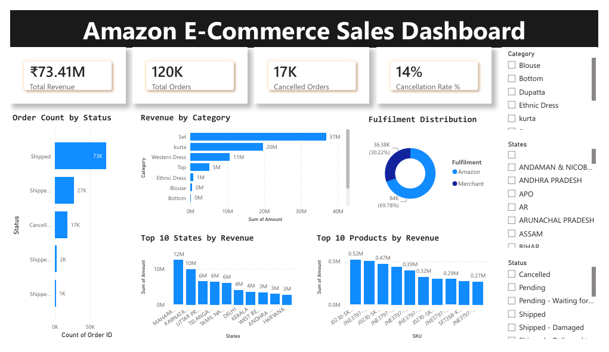

# Amazon E-Commerce Sales Analysis (SQL + Power BI)

## Project Overview

This project demonstrates an end-to-end Data Analytics workflow using SQL and Power BI to analyze Amazon E-Commerce sales data.

The objective is to transform raw sales data into meaningful business insights by performing SQL-based analysis and building an interactive Power BI dashboard.

---

## Dashboard Preview

---

## Business Problem

E-commerce businesses generate large volumes of sales transactions every day. Understanding customer purchasing behavior, product performance, cancellation trends, and fulfillment efficiency is essential for making data-driven decisions.

This project answers key business questions such as:

- Which categories generate the highest revenue?
- Which states contribute the most sales?
- What is the cancellation rate?
- Which products perform best?
- How are orders fulfilled between Amazon and Merchant channels?

---

## Tools & Technologies

- SQL
- Power BI
- Power Query
- DAX
- Data Modeling

---

## SQL Analysis Performed

### Revenue Analysis
- Total Revenue
- Revenue by Category
- Revenue by State
- Revenue by Product

### Order Analysis
- Total Orders
- Order Status Distribution
- Cancelled Orders Analysis
- Cancellation Rate Calculation

### Product Analysis
- Top Products by Revenue
- Best Performing Categories

### Fulfillment Analysis
- Amazon vs Merchant Fulfillment Distribution
- Fulfillment Performance Comparison

---

## Dashboard KPIs

| KPI | Value |
|------|------|
| Total Revenue | ₹73.41M |
| Total Orders | 120K |
| Cancelled Orders | 17K |
| Cancellation Rate | 14% |

---

## Dashboard Features

### Executive KPIs
- Total Revenue
- Total Orders
- Cancelled Orders
- Cancellation Rate

### Sales Analysis
- Revenue by Category
- Top States by Revenue
- Top Products by Revenue

### Order Analysis
- Order Count by Status
- Cancellation Monitoring

### Fulfillment Analysis
- Amazon vs Merchant Fulfillment Distribution

### Interactive Filtering
- Category Filter
- State Filter
- Status Filter

---

## Key Insights

- Set category generates the highest revenue.
- Kurta category is the second highest contributor.
- Maharashtra is the leading state by revenue.
- Amazon fulfillment accounts for nearly 70% of orders.
- Cancellation rate remains around 14%, indicating opportunities for operational improvement.
- A small number of products contribute significantly to total revenue.

---

## Dataset

Source:

https://www.kaggle.com/datasets/thedevastator/unlock-profits-with-e-commerce-sales-data

Note:
The dataset is not included in this repository because of file size limitations.

---

## Repository Structure

Amazon-ECommerce-Sales-Analysis-SQL-PowerBI/

├── amazon_sales.pbix

├── amazon_sales_analysis.sql

├── Amazon_Sales_Dashboard.pdf

├── dashboard.png

└── README.md

---

## Skills Demonstrated

- Data Cleaning
- Data Transformation
- SQL Query Writing
- Data Analysis
- Business Intelligence
- Data Visualization
- Dashboard Development
- KPI Reporting
- DAX Measures
- Power Query

---

## Author

Gunaseelan S

LinkedIn:
https://www.linkedin.com/in/gunaseelan-s-data-analyst/

GitHub:
https://github.com/gunaseelan1904
